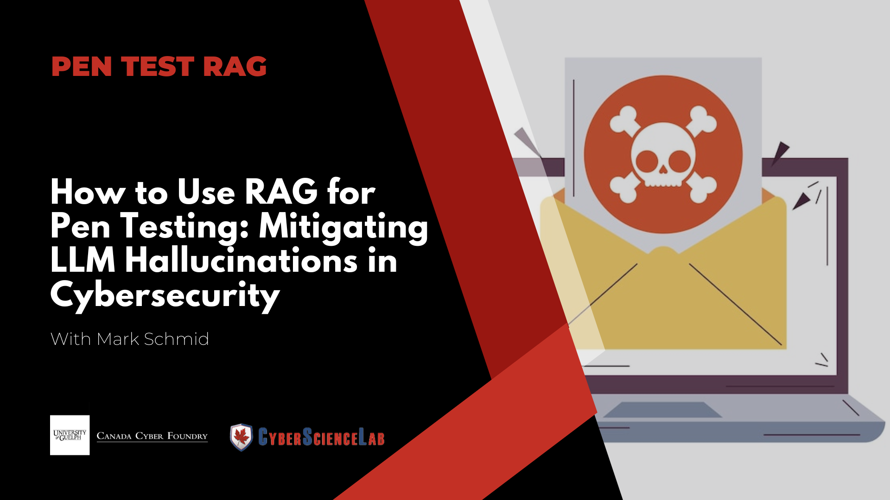
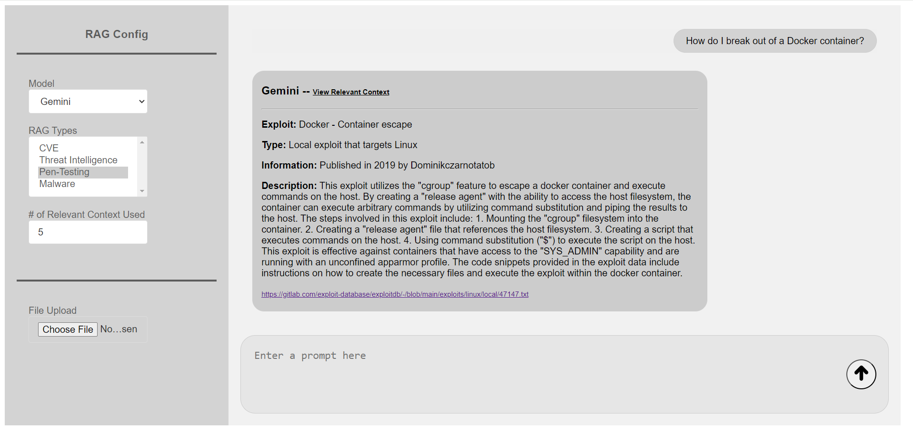
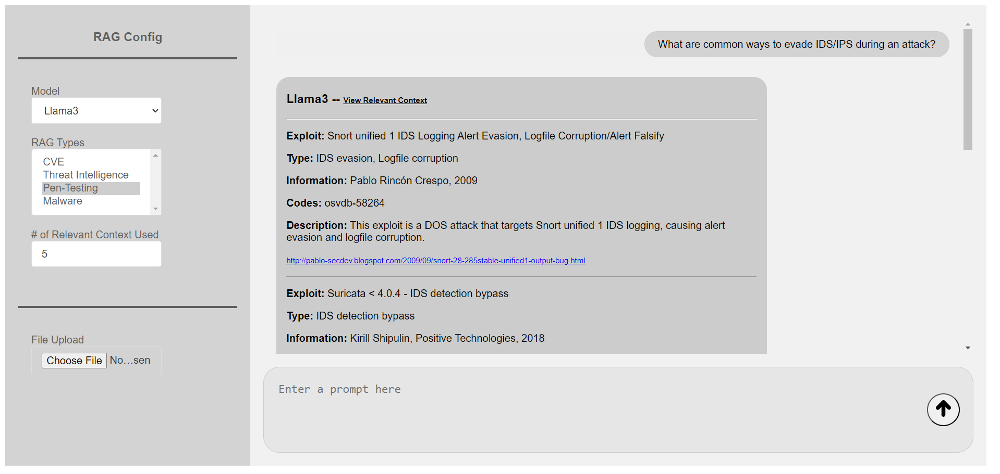
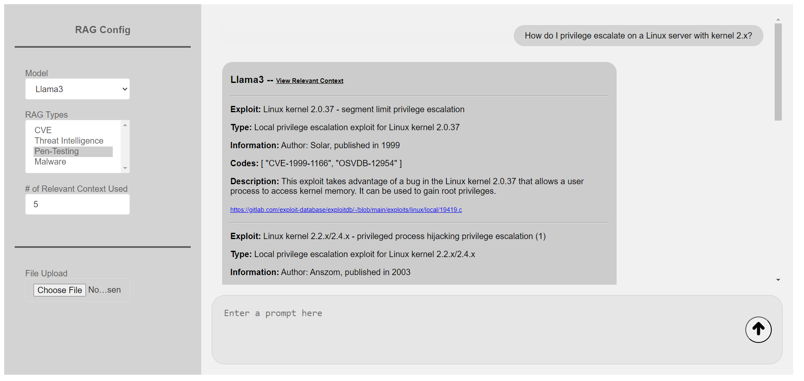

<h1 align="center"> Penetration Testing RAG </h1>

  

## Overview

This project implements a Retrieval-Augmented Generation (RAG) model to provide detailed information about various exploits. By utilizing Meta's Llama3, the system retrieves relevant descriptions and strategies from a comprehensive database to aid in different attack scenarios. It also analyzes files and matches them with code snippets from the database to find related exploits.

Learn more about how to use our Penetration Testing Rag from our [document](assets/Developing_a_Rag_To_Mitigate_LLM_Hallucinations_in_Penetration_Testing.pdf).

For a more interactive learning experience, check out our YouTube video
[**How to Use RAG for Pen Testing**](https://youtu.be/NWp4P6u6TXI?si=5-oWdLatNC4Wip8I).

## Examples

#

  

